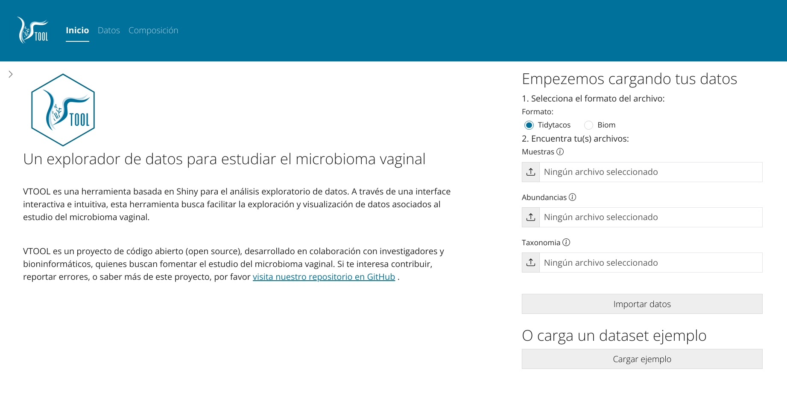
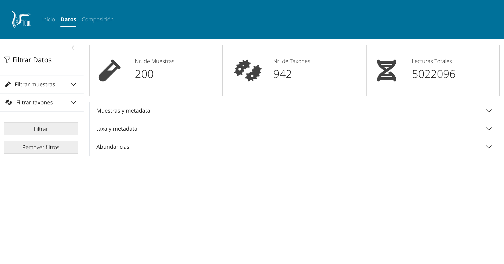
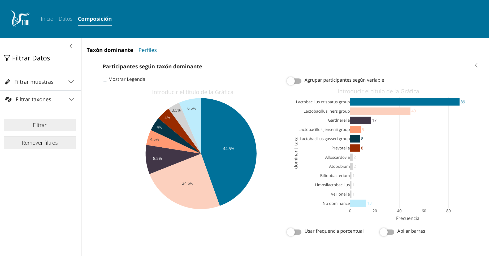
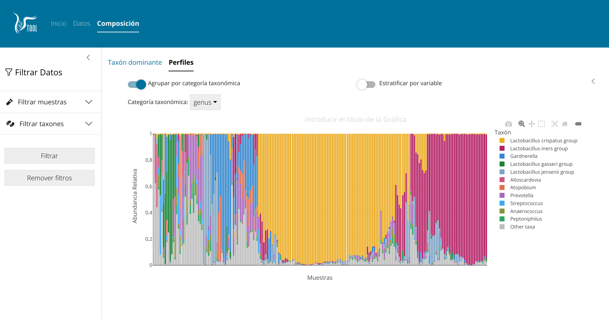

<!-- README.md is generated from README.Rmd. Please edit that file -->

# VTOOL

<!-- badges: start -->
<!-- badges: end -->

VTOOL es una aplicación shiny para la exploración de datos de recuento
de secuanciación microbiana en el contexto del estudio de la microbiota
vaginal y su relación con factores socio-demográficos, clínicos, y de
estilo de vida.

VTOOL se ha desarrollado siguiendo el enfoque de diseño centrado en el
usuario (DCU).

La propuesta incial conceptual de vtool es la siguiente:

## Installación

Puede instalar la versión de desarrollo de VTOOL de la siguiente manera:

    # install.packages("devtools") #un-comment if devtools not installed already
    devtools::install_github("mticlla/VTOOL")

## Uso

VTOOL se puede acceder a través de una aplicación web o ejecutar de
manera local.

    library(VTOOL)
    VTOOL::run_app()
